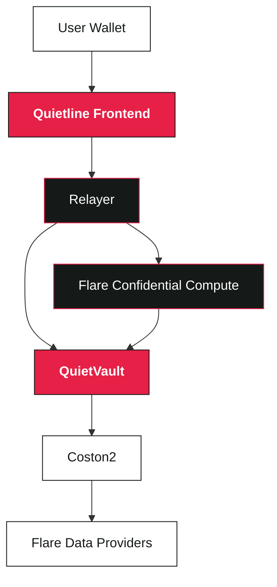
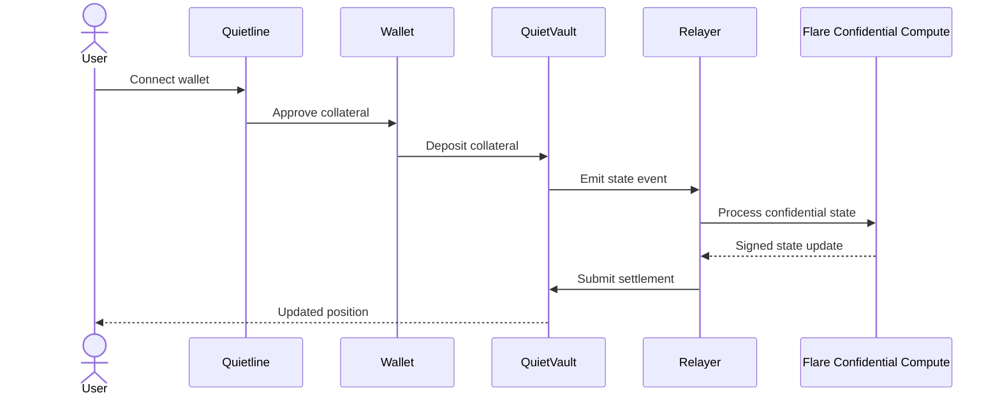
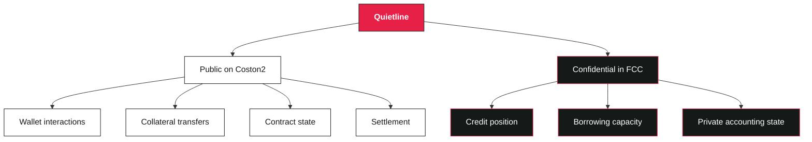

# Quietline

Quietline is a private credit dApp on Flare Coston2 that lets users borrow USD₮0 against FXRP collateral while keeping sensitive credit-position data confidential.

Quietline enables borrowing against collateral while keeping loan terms, collateral health, and lender allocations confidential. Deposits, withdrawals, and transaction timing remain public on chain. The confidential ledger runs in a Flare Confidential Compute (FCC) extension, deterministically settled by TEE signatures on Coston2 QuietVault.

This is a testnet hackathon application built on the official Coston2 simulated-TEE judging mode. It is not audited for production funds.

## Core Concept

User deposits certified FXRP and borrows certified USD₮0 against private lender mandates. Inside FCC, the extension maintains the authoritative ledger: user balances, loan principal, accrued interest, lender allocations, and protocol risk state. Each settled transaction advances a sequential state root signed by the TEE. Payouts execute only through quorum-verified settlements that cannot exceed vault liquidity.

## Live Deployment

- Frontend: https://quietline.vercel.app
- Contract: `0x1C53d0188bA554A23242A2822daBaB802698D511` (Coston2)
- Extension ID: `66008`
- RPC: https://coston2-api.flare.network/ext/C/rpc (Chain ID 114)

## How Quietline Works

Quietline connects the user's wallet, the Coston2 blockchain, the relayer, and Flare Confidential Compute. Public blockchain transactions handle assets and settlement, while sensitive credit state is processed inside the confidential compute environment.



### Deposit Flow

When a user deposits collateral, the transaction is recorded on Coston2 while the resulting credit state is processed by the confidential compute layer.



### Borrowing Flow


### Public and Confidential Data

Quietline does not try to hide the entire blockchain transaction. Assets and settlement remain on-chain, while sensitive credit information is handled inside Flare Confidential Compute.



### From Collateral to Settlement


### Core Components

| Component | Role |
|---|---|
| **Frontend** | Wallet connection and user interface |
| **QuietVault** | Holds collateral, manages credit actions and settlement |
| **Relayer** | Handles authentication, indexing and settlement |
| **Flare Confidential Compute** | Processes confidential credit state |
| **TEE** | Signs valid confidential state transitions |
| **Coston2** | Public settlement and asset layer |
| **Flare Data Providers** | Provide external data used by the confidential computation |

## Coston2 Testnet Deployment

Quietline is deployed on the **Flare Coston2 testnet**.

| Contract / Asset | Address | Purpose |
|---|---|---|
| **QuietVault** | `0x1C53d0188bA554A23242A2822daBaB802698D511` | Main Quietline vault for collateral, borrowing, repayments and settlements |
| **QuietPolicy** | `0x28E7965D7b1c4d1f7CB5837dAd691123dec72694` | Protocol rules, risk parameters and access control |
| **FlareTeeManager** | `0x1a9C4A0f9D76c0b1D91d22E24E573a9b377618aE` | Flare Confidential Compute TEE registration and machine management |
| **Certified FXRP** | `0x0b6A3645c240605887a5532109323A3E12273dc7` | FXRP collateral used by borrowers |
| **Certified USD₮0** | `0xC1A5B41512496B80903D1f32d6dEa3a73212E71F` | USD₮0 used for borrowing and repayment |
| **FTSOv2** | `0xC4e9c78EA53db782E28f28Fdf80BaF59336B304d` | XRP/USD price feed used for collateral valuation |

**Network:** Flare Coston2  
**Chain ID:** `114`  
**RPC:** `https://coston2-api.flare.network/ext/C/rpc`

### Confidential Compute

Quietline uses Flare Confidential Compute through the registered extension:

- **Extension ID:** `66008`
- **TEE Manager:** `0x1a9C4A0f9D76c0b1D91d22E24E573a9b377618aE`

The confidential workload maintains the private credit state and produces signed state updates that are settled through `QuietVault`.

### Verify the Deployment

You can verify the contracts directly on the Coston2 block explorer:

- [QuietVault](https://coston2-explorer.flare.network/address/0x1C53d0188bA554A23242A2822daBaB802698D511)
- [QuietPolicy](https://coston2-explorer.flare.network/address/0x28E7965D7b1c4d1f7CB5837dAd691123dec72694)
- [FlareTeeManager](https://coston2-explorer.flare.network/address/0x1a9C4A0f9D76c0b1D91d22E24E573a9b377618aE)
- [Certified FXRP](https://coston2-explorer.flare.network/address/0x0b6A3645c240605887a5532109323A3E12273dc7)
- [Certified USD₮0](https://coston2-explorer.flare.network/address/0xC1A5B41512496B80903D1f32d6dEa3a73212E71F)
- [FTSOv2](https://coston2-explorer.flare.network/address/0xC4e9c78EA53db782E28f28Fdf80BaF59336B304d)

## Components

### QuietVault (Solidity)

Public custody and settlement boundary. Accepts FXRP and USD₮0 deposits, emits FCC instructions, reads oracle prices, executes only sequential TEE-signed settlements, and rejects payouts exceeding vault liquidity. Does not store debt, health, terms, or lender mandates; those live in FCC.

Key methods:
- `deposit(token, amount)` - submit token to vault, emit FCC instruction
- `requestBorrow(encryptedAcceptance)` - accept encrypted borrow offer
- `requestWithdrawal(token, amount, destination)` - request withdrawal
- `executeSettlement(settlement, signature)` - settle TEE-signed result
- `requestRiskTick()` - trigger liquidation check
- `fundBackstop(amount)` - operator adds risk backstop

Reads:
- FTSOv2 for XRP/USD price (max 5 minutes old)
- FlareTeeManager for FCC instruction dispatch
- TeeMachineRegistry for active TEE status

### FCC Extension (Go)

Confidential ledger and credit engine. Processes deposits, matches lender mandates, evaluates borrowing requests, calculates collateral and debt, enforces LTV limits, liquidates underwater loans, and signs state roots.

Stores:
- Internal asset balances (FXRP, USD₮0)
- User accounts with nonce and session tracking
- Lender mandates (amount, APR, terms, allocation)
- Active loans (principal, accrued interest, maturity, LTV, status)
- Protocol reserve and liquidation backstop
- Processed operation identifiers (idempotency)
- Sequential state root and pending anchor

One mutation may be pending at a time. No second mutation starts until the prior root settles on Coston2 and confirms back to the extension.

Key operations:
- DEPOSIT: credit internal balance, checkpoint
- BORROW_ACCEPT: match mandates, validate price and collateral, emit payout
- WITHDRAW_REQUEST: allocate from internal balance, emit transfer
- RISK_TICK: accrue interest, liquidate if health < 6500 bps LTV
- BACKSTOP_DEPOSIT: credit protocol reserve
- ANCHOR_CONFIRMED: finalize state root, clear pending anchor
- ACCOUNT_QUERY: direct action, return user balance and active loans (encrypted)
- QUOTE_REQUEST: direct action, evaluate borrowing terms (encrypted)

### Relayer (TypeScript + Fastify)

Orchestrates settlement, indexes events, manages session authentication, and runs the liquidation keeper. Stores durable SQLite jobs so operations resume after restart. Acts as session bridge between browser and FCC with EIP-712 authentication.

Responsibilities:
1. Listen to QuietVault deposit/request events
2. Index requestId values, submit to FCC with authenticated payload
3. Poll for signed settlement, validate, relay to QuietVault
4. Confirm settlement root back to FCC
5. Serve authenticated API: `/api/auth/challenge`, `/api/auth/verify`, `/api/account`, `/api/quote`
6. Run periodic keeper: submit fresh FTSO price, trigger risk tick every 60 seconds

Endpoints:
- `GET /api/health` - relayer status
- `POST /api/auth/challenge` - EIP-712 challenge nonce
- `POST /api/auth/verify` - exchange signed challenge for session
- `POST /api/account` - encrypted query: user balance, loans, liquidity
- `POST /api/quote` - encrypted query: borrowing offer at requested amount/term
- `POST /api/accept` - accept encrypted offer, submit to FCC

### Frontend (React + Vite)

Vercel-hosted static application. Never holds FCC secrets. Each private request:
1. Generate ephemeral secp256k1 keypair
2. Sign request with connected wallet (EIP-712)
3. Encrypt signed request to FCC public key (ECIES)
4. Decrypt response in browser memory
5. Clear decrypted state on wallet disconnect or session lock

Uses Wagmi for wallet connection, React Router for navigation, Recharts for charts, Zod for validation.

Routes:
- `/` - landing page
- `/app/dashboard` - account overview, deposit/withdraw/borrow forms
- `/app/borrow` - borrow creation with quote and acceptance
- `/app/repay` - repayment interface (full close only in this release)

## Security and Privacy

### Private (Inside FCC)

- User balances and available collateral
- Loan principal, interest, maturity, health factor, LTV
- Lender mandates and allocation
- Quote generation and lender match
- Repayment allocation and liquidation result

### Public (On Coston2)

- Wallet addresses calling QuietVault
- Deposit amounts, tokens, and timestamps
- Borrow payout and withdrawal destinations and amounts
- FCC instruction request IDs
- State root and sequence number
- Risk tick transactions

### Cryptography

- Wallet authorization: EIP-712 signature with chain ID 114, QuietVault, action hash, nonce, deadline, response public-key hash
- Request confidentiality: secp256k1 ECIES (ephemeral browser keypair)
- Response confidentiality: per-request ephemeral FCC response key
- Settlement authorization: secp256k1 signature from attested TEE node
- State at rest: encrypted BoltDB using AES-GCM with 32-byte operator key
- State commitment: sequential root hash

### Known Limitations

Privacy:
- Transfers, addresses, amounts, and timing are public on chain
- Traffic and timing correlation remain possible
- The active TEE sees plaintext
- Cross-tab nonce races possible in browser mutation serialization

Operational:
- One active loan per account
- Full repayment only (no partial repayment)
- Fixed 7, 14, and 30 day terms
- Single TEE instance; loss requires redeployment
- Single relayer; downtime pauses settlements
- No hardware-backed confidentiality (simulated-TEE mode only)
- Unaudited

See [KNOWN_LIMITATIONS.md](docs/KNOWN_LIMITATIONS.md) for complete list.

## Documentation

- [Architecture](docs/ARCHITECTURE.md) - system design, transaction flows, invariants
- [Security and Privacy](docs/SECURITY_AND_PRIVACY.md) - threat model, defenses, operational requirements
- [Deployment (Coston2)](docs/DEPLOYMENT_COSTON2.md) - step-by-step deployment and judging setup
- [Operations](docs/OPERATIONS.md) - monitoring, debugging, troubleshooting
- [Live Testnet Runbook](docs/LIVE_TESTNET_RUNBOOK.md) - operational procedures
- [Known Limitations](docs/KNOWN_LIMITATIONS.md) - scope, privacy, operational constraints

## Repository Structure

```
contracts/              Solidity contracts (QuietVault, QuietPolicy)
extension/              Go FCC extension and confidential engine
relayer/                TypeScript Fastify relayer and keeper
frontend/               React Vite browser application
packages/protocol/      Shared Coston2 constants and TypeScript types
fcc/                    FCC proxy config, Docker Compose, tee-node vendored copy
docs/                   Architecture, security, deployment, operations guides
scripts/                Coston2 deployment and hosting automation
```

## Summary

Quietline demonstrates private credit settlement on a public blockchain. The extension maintains a confidential ledger matched against public vault custody. TEE signatures authenticate settlements atomically. No mock or quick-tunnel URLs are used. The deployment operates on live Coston2 with officially-provided test assets and FCC infrastructure.
